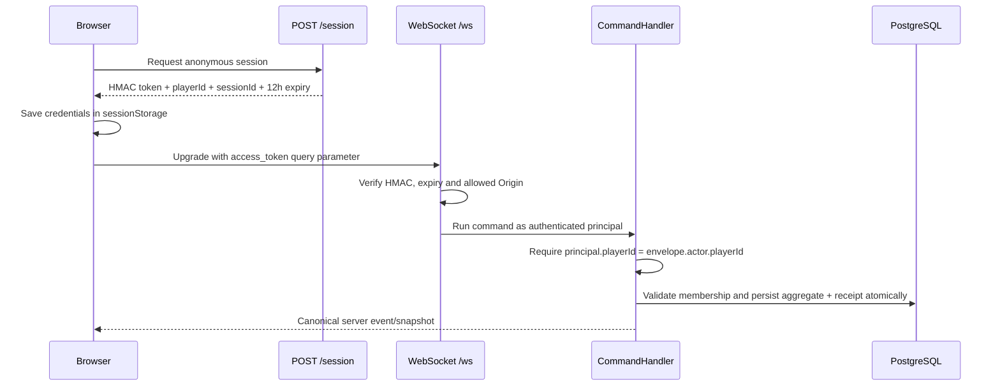
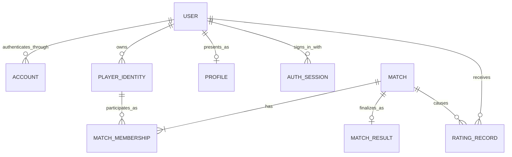

# Account architecture audit

Status: design only

Branch: `design/account-architecture`

Audit date: 2026-07-13

Source commit: `84cf176d3a892c9685a13003fc8d86268e10407f`

This document proposes an account and identity architecture for Assalto Reale. It
does not implement authentication, add migrations, define ratings, enable public
matchmaking, or change production behavior.

## 1. Verified current repository and deployment state

The local branch was created from `origin/main` at `84cf176`. The four stated
product-readiness commits are present in order:

- `2b8010b` — in-match online UX polish;
- `6d765a5` — plain lobby status instead of raw match id;
- `23b51af` — top-level error boundary;
- `84cf176` — operational logging and backup/restore documentation.

Verification on 2026-07-13 found:

- Authoritative Server CI completed successfully for `84cf176`.
- Main CI had six successful jobs, but `web-e2e-cross-browser` remained in
  progress at the Playwright Firefox/WebKit installation step. No test failure
  had been reported, but main CI was not green as a whole.
- GitHub Pages returned HTTP 200, but its live `release-metadata.json` identified
  `5e0eabb`, not `84cf176`. Therefore the four commits above were not yet in the
  published frontend at audit time.
- Railway `/healthz` returned `200 {"status":"ok"}` and `/readyz` returned
  `200 {"status":"ready"}`. The public backend does not expose build metadata,
  so its exact deployed commit could not be proven from public endpoints.

This is a release-verification gap, not evidence of a product regression. It
must be resolved before treating `84cf176` as fully deployed.

## 2. Current guest identity flow



Current properties:

- `HmacGuestSessionService` generates unrelated random `playerId` and
  `sessionId` values and signs them into a stateless, default 12-hour token.
- The token, player id, session id, active-match hint, and pending create/join
  intent are stored in browser `sessionStorage`. Closing the browser session or
  token expiry ends recoverability.
- The WebSocket authenticates at upgrade. The transport principal is propagated
  through `AsyncLocalStorage`; the command handler checks it against the actor in
  every protocol envelope.
- Match membership is embedded directly in `authoritative_matches` as nullable
  `black_player_id` and `white_player_id` text fields. There is no player,
  identity, user, account, or profile table.
- A reconnect requires the same guest identity and a locally remembered match
  id. `RequestSync` validates membership and returns a canonical snapshot. When
  the old match has a successor, the server redirects the member to that rematch.
- Command receipts bind a globally unique `command_id` to `player_id`, payload
  hash, match id, and returned envelopes. They support exact replay but are not
  an authentication or match-history system.
- Rematch lineage is stored by `predecessor_match_id` and
  `successor_match_id`. The new aggregate preserves the same player ids while
  swapping sides.
- Offline saves use `localStorage` and are separate from online identity.
- Routes are client-side and currently include Home, Setup, Online, Game, Rules,
  Load, and Settings. Home can resume only the single online match hinted in the
  current browser session.

The current flow is internally consistent for short-lived private guest play,
but it cannot provide durable identity, cross-device discovery, or safe recovery
after guest-token expiry.

## 3. Proposed domain model



The responsibilities are:

- **User**: the durable product person/account owner. It is the authorization
  root for cross-device resume, profile ownership, history visibility, and any
  future rated participation.
- **Account**: one verified login method identified by `(issuer, subject)`, such
  as Auth0 email OTP or Google. A user may have multiple accounts. Email is an
  attribute, never the identity key and never sufficient by itself for linking.
- **AuthSession**: a revocable login session issued by the selected identity
  provider. In the recommended first implementation the provider owns session
  storage and refresh; Assalto Reale validates short-lived API access tokens and
  does not store passwords or refresh tokens.
- **GuestIdentity**: represented by a `PlayerIdentity` with no `user_id`. It can
  play casual private matches and may later be claimed by a user after proof of
  control.
- **PlayerIdentity**: the stable principal used by the game domain. It decouples
  match membership from a login provider and can survive a guest-to-user upgrade
  without rewriting match facts.
- **MatchMembership**: one immutable participant slot in one match, including
  side and the participating player identity. It replaces embedded black/white
  text ids as the relational authority.
- **Profile**: user-controlled public presentation data. It is not an auth
  credential and is mutable independently from immutable results.
- **MatchHistory/MatchResult**: an immutable final record produced by the
  authoritative server, not reconstructed by React.
- **RatingRecord**: an append-only change caused by one eligible finalized
  match. A separate current-rating projection supports reads.

## 4. Proposed database model

Names are illustrative; exact SQL belongs in a later migration PR.

| Table | Essential fields and constraints |
| --- | --- |
| `users` | UUID id; lifecycle status; created/deleted timestamps; no provider subject as primary key |
| `user_accounts` | UUID id; user id; issuer; provider subject; verified email metadata; unique `(issuer, provider_subject)` |
| `auth_sessions` (optional local read model) | UUID id; user/account id; provider session id hash; assurance; last-seen, expiry, and revoked timestamps; never an access or refresh token |
| `player_identities` | UUID id; nullable user id; kind (`guest`/`registered`); created/claimed/revoked timestamps; unique legacy player id during migration |
| `profiles` | user id PK; normalized username; display name; avatar reference; visibility; moderation timestamps; unique case-insensitive normalized username |
| `match_memberships` | match id + side unique; player identity id; immutable `user_id_at_start` nullable; joined/left timestamps; display-name snapshot if approved |
| `match_results` | match id PK; ruleset/config version; rated flag; validity; winner membership; end reason; start/end times; final version/sequence; final-state hash; finalized timestamp |
| `rating_state` | user id + queue/ruleset key PK; current rating; games; version; updated timestamp |
| `rating_records` | UUID id; unique `(match_id, user_id, rating_system_version)`; before/delta/after; opponent; created timestamp |
| `websocket_tickets` | hashed random ticket; principal/session; expiry; consumed timestamp; optional during the registered-auth phase |

`authoritative_matches` remains the mutable gameplay aggregate initially.
Membership should be normalized without moving game state out of the aggregate in
the same migration. `authoritative_command_receipts` needs a documented bounded
retention policy; it must not be treated as permanent history.

Do not store passwords in this database when using the recommended managed
identity provider. Provider refresh credentials also remain provider-managed.

## 5. Guest and account coexistence

Yes, guests should continue to host and join private casual matches. Requiring an
account at the existing invite-play entry point would regress the core product
loop.

Both guest and registered connections should resolve to the same internal
principal shape:

```text
AuthenticatedPrincipal
  playerIdentityId
  userId?             // absent for a guest
  authSessionId
  assurance           // guest | verified-account
```

The authoritative server continues to validate the principal, membership, side,
phase, version, idempotency, and command. React never decides whether a user owns
a membership.

Private invite matches are casual regardless of whether their players are guests
or users. Account-only capabilities are cross-device match discovery, durable
history/profile, and later rated matchmaking.

## 6. Guest-to-account upgrade

Upgrade is a server-side claim transaction, not a client-side id rewrite:

1. The browser proves control of the current guest identity with an unexpired
   guest credential.
2. The same browser completes provider authentication.
3. The backend verifies both proofs and creates or loads the local `User` and
   `Account`.
4. In one transaction it sets the guest `PlayerIdentity.user_id`, records claim
   audit metadata, and rejects any identity already claimed by another user.
5. Existing memberships continue to reference the same player identity. No
   match, receipt, result, or rematch lineage is rewritten.
6. The browser rotates to registered-user credentials and synchronizes active
   matches from the server.

Existing guest matches can attach only while the guest can prove the identity.
The current stateless 12-hour token provides no safe recovery proof after expiry
or loss. Historical guests must not be claimed by invite code, player id, email,
or display name. During rollout, still-valid legacy HMAC tokens may perform a
one-time claim. Expired legacy identities remain unattached and unrated.

New guest sessions should eventually persist a player identity and use renewable,
rotating credentials or an explicit recovery mechanism. That is a separate
security design and should not silently turn a browser guest into a permanent
tracking identifier.

## 7. Cross-device resume

A registered user signs in on the second device. The backend maps verified
`(issuer, subject)` to a local user and queries memberships through all player
identities owned by that user. It returns authorized active-match summaries;
selecting one sends `RequestSync` and receives the canonical snapshot.

The browser may cache the last selected match as a convenience, but server-side
membership discovery is the authority. The design must handle more than one
active membership even though the current UI caches one match. Whether the
product permits multiple simultaneous active matches is an owner decision; the
database should not accidentally prevent it.

## 8. WebSocket authentication

Registered users should authenticate a normal HTTPS request with a short-lived
API access token. The backend validates signature, algorithm, issuer, audience,
expiry/not-before, authorized party where available, and key id against a cached
JWKS. It then issues a random, single-use, very short-lived WebSocket ticket.

The browser opens `/ws?ticket=...`; the server atomically consumes the hashed
ticket and binds the connection to the internal principal. This avoids placing a
provider access token or long-lived guest token in a URL, proxy log, browser
history, or diagnostic trace. Reconnect obtains a new ticket.

Guest connections should converge on the same ticket exchange when guest session
hardening is implemented. During migration the existing HMAC verifier can remain
behind a composite connection authenticator.

Authentication belongs in `server-transport`; provider-token verification should
be an injected adapter. Principal-to-user/player resolution belongs in the
application/persistence layer. Command and membership authorization remains in
`authoritative-server`.

## 9. Casual versus rated policy

- Existing private invite matches remain casual and may include guests or users.
- A casual match never changes rating, even when both participants have accounts.
- Rated matches require two authenticated users and server-created membership
  before the match starts.
- Rated eligibility, settings, ruleset version, and rating system version are
  fixed on the match at creation; they cannot be toggled at the result screen.
- A guest-to-account upgrade never retroactively rates earlier matches.
- Recommended policy: direct invites and immediate rematches are casual. A rated
  rematch should require re-entry into rated matchmaking to avoid opponent
  selection and rating farming. Owner approval is required.

Ratings and matchmaking remain out of scope until durable users and authoritative
history have shipped and been observed in production.

## 10. Immutable match history

Create participant records when membership is established and finalize exactly
one result when the authoritative match becomes terminal. Immutable facts are:

- match id and predecessor/successor lineage;
- ruleset, protocol, configuration, seed policy version, rated/casual flag;
- participant identity, side, and user-at-start snapshot;
- started and ended timestamps from the server clock;
- winner/loser or void result and normalized end reason;
- final aggregate version, stream sequence, and canonical final-state hash;
- result-validity and rating-system version;
- rating record references, when applicable.

Profile presentation and deletion redaction are separate mutable views. Command
receipts are insufficient as history: they are idempotency artifacts, may include
recipient-specific responses, and currently have no retention or complete event
log guarantee.

The owner must decide whether history means result summaries only or includes a
full replay. Full replay requires an append-only accepted-command/domain-event
log with a schema and ruleset version; it should not be inferred later from
receipts.

## 11. Elo update transaction

When a rated match becomes terminal, one PostgreSQL transaction must:

1. lock the match and both users' `rating_state` rows in deterministic user-id
   order;
2. verify that the result is finalized, valid, eligible, and not already rated;
3. calculate both deltas with a versioned deterministic Elo policy;
4. insert two append-only `rating_records` with uniqueness on match/user/system;
5. update both current-rating projections;
6. mark the match result as rating-processed;
7. persist the terminal aggregate, result, outgoing envelopes, and command
   receipt atomically.

Retries replay the committed receipt or encounter the rating uniqueness guard;
they never apply Elo twice. Rating calculation must not run in React or an
eventually consistent best-effort callback.

Resignation is a loss. A temporary disconnect is not a result. Timeout may be a
loss only after server-authoritative clocks exist. Abandonment requires an
explicit grace/adjudication policy. Invalid/void matches do not change rating.
No currently stored legacy match should receive a retroactive rating.

## 12. Account deletion and privacy

Deletion should immediately revoke provider/app sessions, disable sign-in, remove
public profile visibility, and queue erasure of email and other direct personal
data. The provider account must also be deleted or unlinked through the provider's
supported process.

Competitive integrity requires retaining minimal pseudonymized match facts and
rating ledger entries. Keep opaque tombstone user/player ids, sides, results, and
rating arithmetic; erase email, provider metadata no longer legally required,
avatar, bio, and public username association. History presentation should show a
neutral deleted-player label. This separates immutable game facts from mutable,
redactable personal presentation.

Before implementation, publish a privacy notice, retention schedule, account-data
export, deletion SLA, backup-erasure policy, processor list, and legal basis for
retaining pseudonymized competitive records. Current documentation has operations
notes but no complete user-facing privacy policy.

## 13. Authentication recommendation and alternatives

Recommendation: use a managed OIDC provider, initially Auth0 Universal Login with
email one-time-code login and optional Google social login. Use Authorization Code
with PKCE in the static React SPA; send an API access token to Railway only over
HTTPS; map the verified issuer/subject to the local account model. Do not build
password storage, reset flows, email verification, or refresh-token handling in
the game server.

Why this fits:

- the frontend is a static GitHub Pages SPA and the backend is a separate Node
  service, a standard public-client/API split;
- OIDC issuer/subject mapping keeps the game database provider-neutral;
- hosted login reduces security-sensitive UI and email-delivery code;
- email OTP avoids local passwords and works for users without Google;
- Google can reduce friction without becoming the only login method;
- the existing injectable bearer verifier and transport boundary are ready for a
  provider adapter.

Do not automatically link accounts because emails match. Require a signed-in user
to prove the second provider account before linking.

Alternatives:

- **Clerk**: strongest React-first developer experience and short-lived JWT/JWKS
  support, but more provider-specific frontend/session behavior.
- **Supabase Auth**: capable password, OTP, social, JWT, and JWKS support, but adds
  a second data platform beside Railway PostgreSQL and is a weaker architectural
  fit unless the project intends to adopt more of Supabase.
- **Self-hosted email/password or auth library**: highest operational and security
  burden; not recommended for the first durable-account release.
- **Magic link**: acceptable, but email OTP is recommended first because it is
  less sensitive to the email link opening in a different browser/device. Auth0
  also documents important connection/linking distinctions for passwordless and
  social identities.

References reviewed: Auth0 Authorization Code + PKCE, Universal Login,
passwordless email, token validation; Clerk session-token verification; Supabase
Auth/JWT verification. Provider selection and budget remain owner decisions.

- [Auth0 Authorization Code with PKCE](https://auth0.com/docs/api/authentication/authorization-code-flow-with-pkce/authorize-with-pkce)
- [Auth0 Universal Login](https://auth0.com/docs/authenticate/login/auth0-universal-login/universal-login-vs-classic-login/universal-experience)
- [Auth0 passwordless authentication](https://auth0.com/docs/authenticate/passwordless)
- [Auth0 access-token validation](https://dev.auth0.com/docs/secure/tokens/access-tokens/validate-access-tokens)
- [Clerk token verification](https://clerk.com/docs/reference/backend/verify-token)
- [Supabase Auth and JWT verification](https://supabase.com/docs/guides/auth)

## 14. Migration plan

No migration is included in this branch. A later plan should be additive and
rollback-safe:

1. Add user, account, player-identity, profile, and normalized membership tables
   without changing command behavior.
2. Backfill one player identity for every distinct existing black/white player id
   and one membership per populated side. Preserve legacy ids for translation.
3. Dual-write embedded member columns and normalized memberships; verify parity
   before switching reads.
4. Add managed-auth verification and user/account provisioning behind a feature
   flag; guests remain the default-safe path.
5. Add explicit, proof-based guest identity claim and registered cross-device
   membership discovery.
6. Introduce short-lived WebSocket tickets and then retire long-lived token query
   authentication after all supported clients migrate.
7. Add immutable history tables and transactional finalization. Backfill legacy
   ended matches only as `legacy_unverified`/casual where winner and chronology
   cannot be proven. Never infer missing facts or rate them.
8. Add rating tables and processing only after history correctness is proven.

Each schema migration must be append-only in the existing checksum system; never
edit migrations 1 or 2.

## 15. Security and privacy risks

- Current 12-hour guest tokens appear in the WebSocket query string and may leak
  through infrastructure logs or diagnostics.
- `sessionStorage` credentials are readable by injected JavaScript; XSS would be
  an account/session takeover risk after durable auth.
- Account-linking by email enables takeover; require proof of both identities.
- JWT validation must pin issuer, audience, algorithm, time claims, and key id and
  handle JWKS rotation/outage safely.
- OAuth requires PKCE, state, nonce where applicable, strict callback URLs, and no
  open redirects.
- `/session`, auth callbacks, WebSocket tickets, invite lookup, username checks,
  and recovery endpoints require rate limits and abuse monitoring.
- Origin allowlists are defense in depth, not identity or authorization.
- Ticket consumption, identity claim, history finalization, and rating updates
  require transactional uniqueness to prevent races/replay.
- Provider outage must not corrupt or silently replace an established identity.
- Usernames need normalization, Unicode/confusable policy, reserved names,
  moderation, rename limits, and enumeration-safe availability checks.
- Logs, receipts, backups, and provider metadata need explicit retention and
  erasure policies. Player ids should be treated as pseudonymous identifiers,
  not declared non-personal by default.
- A guest-secret rotation currently invalidates every outstanding guest token;
  rotation and incident-recovery behavior must be designed.
- Public profiles/history create harassment and scraping risks; visibility and
  block/report policy require product review before launch.

## 16. Implementation phases

1. Resolve the current main CI/Pages release gap.
2. Approve identity, provider, privacy, username, and guest policy decisions.
3. Add identity/membership schema and backfill with no UI behavior change.
4. Integrate managed sign-in and local user/account provisioning.
5. Add safe guest upgrade and cross-device active-match discovery.
6. Replace WebSocket query credentials with short-lived tickets.
7. Add profiles and account settings/deletion/export.
8. Add immutable authoritative match history.
9. Observe, reconcile, and operationally validate history in production.
10. Add Elo, then public matchmaking, then leaderboard/profile publication.

## 17. Proposed branch and PR sequence

Keep every branch reviewable and do not combine auth, history, and ratings:

1. `design/account-architecture` — this audit only.
2. `schema/player-identities-memberships` — additive tables, backfill, dual-write.
3. `auth/provider-verification` — provider adapter, config, tests; no profile UI.
4. `auth/user-provisioning` — user/account mapping and guarded APIs.
5. `auth/guest-upgrade` — proof-based claim and compatibility tests.
6. `auth/websocket-tickets` — short-lived ticket exchange and credential removal.
7. `accounts/profile-settings` — username/profile, sessions, deletion/export.
8. `history/authoritative-results` — immutable finalization and history reads.
9. `rating/elo-ledger` — versioned atomic rating records.
10. `matchmaking/rated-queue` — only after the preceding production gates.

Each PR should include migrations only when its schema is used, migration rollback
notes, package-boundary tests, threat-model updates, and an explicit deployment/
live-validation handoff. Nothing should merge or deploy automatically from this
audit.

## 18. Product decisions requiring owner approval

1. Auth provider and acceptable recurring cost/vendor lock-in.
2. Initial login methods: recommended email OTP plus Google; whether GitHub is
   useful for the actual player audience.
3. Whether guests receive durable recovery beyond the current browser session.
4. Whether a user may own/link multiple prior guest identities.
5. Whether multiple simultaneous active matches are allowed.
6. Username format, uniqueness, rename cadence, moderation, and deleted-name reuse.
7. Public/private profile and match-history visibility defaults.
8. Result-summary history versus full replay/event history.
9. Rated eligibility, provisional/K-factor policy, and rating reset/seasons.
10. Whether immediate rematches are always casual (recommended).
11. Disconnect grace, abandonment adjudication, and void/invalid-match authority.
12. Data retention, deletion SLA, export, backup erasure, and minimum-age policy.
13. Whether legacy guest matches appear in upgraded account history.
14. Whether a stable public user id is exposed or only username/profile slug.

## 19. Files inspected

- `.github/workflows/ci.yml`
- `.github/workflows/deploy-pages.yml`
- `.github/workflows/server-ci.yml`
- `packages/server-transport/src/guestSessions.ts`
- `packages/server-transport/src/connectionAuth.ts`
- `packages/server-transport/src/contextualAuthenticator.ts`
- `packages/server-transport/src/transportServer.ts`
- `packages/authoritative-server/src/commandHandler.ts`
- `packages/authoritative-server/src/domain/matchAggregate.ts`
- `packages/authoritative-server/src/ports.ts`
- `packages/authoritative-server/src/repositories.ts`
- `packages/authoritative-server/src/persistence/postgres/migrations.ts`
- `packages/authoritative-server/src/persistence/postgres/postgresPersistence.ts`
- `packages/authoritative-server/src/persistence/postgres/codec.ts`
- `packages/multiplayer-protocol/src/types.ts`
- `packages/multiplayer-protocol/src/validation.ts`
- `packages/server-runtime/src/config.ts`
- `packages/server-runtime/src/compose.ts`
- `web/src/online/onlineIdentity.ts`
- `web/src/online/onlineClient.ts`
- `web/src/online/onlineIntent.ts`
- `web/src/online/onlineStore.ts`
- `web/src/app/AppRouter.tsx`
- `web/src/app/routes.ts`
- `web/src/pages/HomePage.tsx`
- `web/src/pages/OnlinePage.tsx`
- `docs/authoritative-server.md`
- `docs/current-product-status.md`
- `docs/match-lifecycle-contract.md`
- `docs/multiplayer-deployment.md`
- `docs/multiplayer-protocol.md`
- `docs/online-session-recovery.md`
- `docs/operational-readiness.md`
- `README.md`, `docker-compose.yml`, and relevant package manifests/tests.

The audit also inspected commit history/diffs, public GitHub Actions state, live
Pages release metadata, and Railway health/readiness responses.

## 20. Final recommendation

Preserve guest private play. Introduce a provider-neutral local `User`/`Account`
model above a stable `PlayerIdentity`, normalize match memberships, and let a
proved guest identity attach to a user without rewriting historical participation.
Use managed OIDC (recommended Auth0 Universal Login with email OTP and optional
Google), verify it at the transport/API boundary, and exchange it for single-use
short-lived WebSocket tickets. Make registered cross-device resume a server-side
membership query, not a browser-storage feature.

Ship immutable authoritative result history before any Elo. Apply Elo exactly
once in the same transaction that finalizes an eligible result, and require
accounts for rated matchmaking while keeping invites/rematches casual. Separate
immutable competitive facts from deletable personal presentation data.

First resolve and verify the current `84cf176` CI/Pages deployment gap. Then seek
owner approval for the decisions in section 18 before writing migrations or auth
code.
